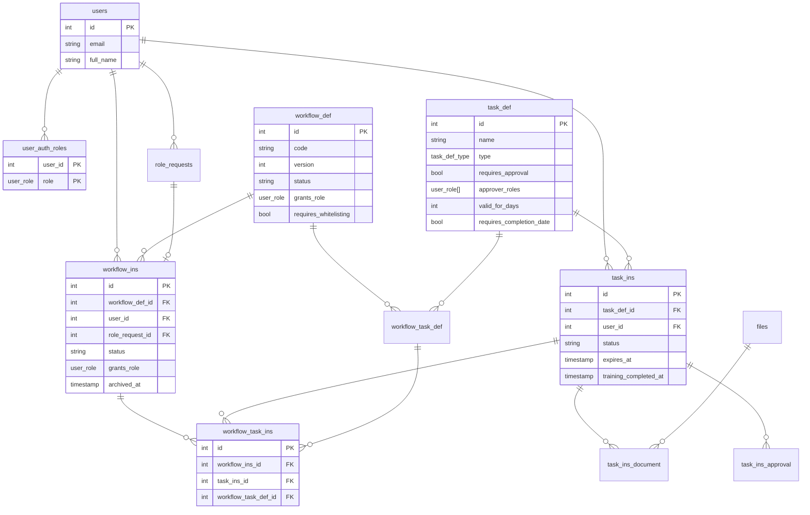

# Attestation schema — decisions

Naming: `_def` = template, `_ins` = live run. Target: replace Approbo **inside DAME** (same DB, same backend).

## Tables

DAME already has: `users`, `user_role` enum, `role_requests`, `files`. Do **not** recreate those in DAME; the prototype stubs them.

New:

- `task_def`
- `workflow_def`
- `workflow_task_def`
- `task_ins`
- `workflow_ins`
- `workflow_task_ins`
- `task_ins_document`
- `task_ins_approval`

Prototype-only: `user_auth_roles` (stand-in for auth groups). Does not ship to DAME. Roles are **not** a column on `users`.

## Core idea

Defs are reusable blueprints. Instances are live work for a user. Overlap lives in the **instance** layer.

- Same `task_def` can sit on many `workflow_def` rows via `workflow_task_def`.
- A user can have many `workflow_ins` at once.
- Do **not** put `workflow_ins_id` on `task_ins`. Two workflow runs share work by pointing at the **same** `task_ins` through `workflow_task_ins`.
- Completing a shared task once advances every workflow that links to that `task_ins`.

### Dedup walkthrough

Two workflows for the same user, both containing task T:

1. Create `workflow_ins` A and B.
2. A needs T → no `task_ins` yet → insert one for `(user, T)` → link from A.
3. B needs T → `task_ins` already exists → do **not** insert another → only insert a second `workflow_task_ins` from B to that row.

Result: 2 `workflow_ins`, 1 `task_ins`, 2 `workflow_task_ins`. Complete once → both workflows see it done.

### `task_ins` vs `workflow_task_ins`

They are not duplicated data.

| Table | Question it answers |
|---|---|
| `task_ins` | The work: who, which task, status, timestamps. One row per `(user, task_def)`. |
| `workflow_task_ins` | The link: this workflow run uses that work for this template slot. One row per `(workflow_ins, slot)`. |

Do **not** copy status, due dates, or completion onto the link table. If you did, one workflow could say done and the other pending.

The only overlapping keys are intentional: `task_ins.user_id` / `task_ins.task_def_id` exist so the unique constraint that forces dedup can live on `task_ins`. Keep them in sync with `workflow_ins.user_id` and `workflow_task_def.task_def_id`.

## Dedup: DB vs backend

Split it.

- **DB** — the invariant. Unique constraints + FKs. Stops two concurrent enrollments from creating two copies.
- **Backend** — the policy. Find-or-reuse, when *not* to reuse (expired, cancelled sibling, different meaning), linking `workflow_task_ins`, and whether completing a shared `task_ins` completes any `workflow_ins`.

Do find-or-link in one transaction. If the unique constraint fires, catch it and attach to the existing row. Do **not** put policy in triggers or stored procs.

Short version: DB makes double-create impossible. Backend decides what “same task” means.

### Constraints that enforce this

Dedup is a unique constraint, not a new table:

```sql
ALTER TABLE task_ins
  ADD CONSTRAINT task_ins_user_task_def_uk UNIQUE (user_id, task_def_id);

ALTER TABLE workflow_task_ins
  ADD CONSTRAINT workflow_task_ins_workflow_slot_uk UNIQUE (workflow_ins_id, workflow_task_def_id);
```

- `task_ins (user_id, task_def_id)` — **this is the dedup**. One work row per user per task. Forces reuse.
- `workflow_task_ins (workflow_ins_id, workflow_task_def_id)` — a different bug. One link per slot on a workflow run. Stops attaching the same step twice. Does **not** stop two `task_ins` rows.

If you only care about sharing tasks, the first is required. Add the second when enrollment is wired so a retry cannot insert two links for the same step.

Also unique on `workflow_task_def (workflow_def_id, task_def_id)` unless a workflow can include the same task twice.

To *not* share: drop the `task_ins` unique and do not reuse rows. The join table can still exist; it just would not collapse two workflows onto one task.

## Columns

**`users` (DAME / stub):** `id`, `email`, `full_name`. No `roles` column.

**`user_auth_roles` (prototype only):** `(user_id, role user_role)` PK. Live approver/whitelist checks read this.

**`role_requests`:** `id`, `user_id`, `requested_role`, `approved_role`, `status`. `workflow_ins.role_request_id` points here.

**`task_def`:** `name`, `description`, `type` (`document` | `acknowledgement`), `requires_approval`, `approver_roles user_role[]`, `valid_for_days`, `requires_completion_date`, `archived_at`.

**`workflow_def`:** `code` + `version` (identity), `status`, `grants_role user_role` (nullable), `requires_whitelisting`. Unique `(code, version)`. One **active** def per `grants_role`. Optional `supersedes_id`.

**`workflow_task_def`:** slot on a def. Unique `(workflow_def_id, task_def_id)`.

**`workflow_ins`:** pinned to a def, `user_id` → `users`, `role_request_id`, `grants_role` copied at enroll, fat status, `archived_at`, whitelist columns. One **open** run per `(user, grants_role)`.

**`task_ins`:** the work. Unique `(user_id, task_def_id)`. Status pending/submitted/approved/rejected/completed/expired. `expires_at` snapshot. `training_completed_at` for NIH-style certs.

**`workflow_task_ins`:** link only. Unique `(workflow_ins_id, workflow_task_def_id)`.

**`task_ins_document`:** file + signature on the shared work row.

**`task_ins_approval`:** decision on the shared work row. Eligibility is live vs `user_auth_roles` ∩ `task_def.approver_roles`.

Completing a workflow with `grants_role` inserts that role into `user_auth_roles` (DAME: `authGroupsService.addUserToGroupByRole`).

Keep `workflow_task_def_id` on the instance join so you know which template slot this fulfills.

## Versioning

**MVP: version workflows only. Skip task versions.**

### Workflow version = new composition

Do not mutate an active `workflow_def`. Insert a new row (`code` + `version`, old one `archived`). Existing `workflow_ins` stay pinned to the old def. New `workflow_task_def` rows even for the same tasks — those are new slots, not new work. No change to `task_ins` / `workflow_task_ins` shape.

- **Drain (default):** archive the old def, let in-flight `workflow_ins` finish. Dedup only matters when someone later starts v2.
- **Force upgrade:** archive old ins, start v2 ins. Dedup does the useful work: new `workflow_ins` + new `workflow_task_ins` links, **same** `task_ins` for unchanged tasks. User opens v2 already partly done.

Do not delete old ins or their links. History stays; `task_ins` is shared and must survive.

### Task version = new meaning (not MVP)

Only create a new `task_def` when the user must do something different (new text, new form, new legal doc). Unchanged tasks keep the same `task_def` id. That is how “mostly the same tasks” stays cheap.

If you bump task version as a new row, unique `(user_id, task_def_id)` means the old completion does **not** count. That is usually what you want.

Do **not** overwrite `task_def` in place and bump a version column: dedup still sees the same id and people skip the new attestation.

Add task versions later only if you need lineage like “everyone currently on DUA v3.”

Unique `(user, task_def)` means “same task = done forever.” Compatible with reuse-on-upgrade. **Not** compatible with “upgrade means re-sign even if the task did not change.” That would need a policy (invalidate `task_ins`, or a new identity) and a weaker unique (e.g. one **open** row per user+task).

## Mutability of `task_def`

“Immutable” means **don’t replace the row**. Same `task_def` id forever so dedup keeps working. It does **not** mean never `UPDATE`.

**Fine to mutate:** name, description, copy, display order, quorum (for open work), expiration period. Same id, same dedup. All `task_ins` rows see the new labels/config.

**Not fine to mutate in place:** the thing the user actually did (document text, form fields, legal meaning). Same id + unique `(user_id, task_def_id)` means they will not be asked again.

Treat as a **new** `task_def` only when an already-done user must do different work, not when you edited labels or the clock.

**Quorum** sits in the middle. Changing 2-of-3 to 3-of-3 on the def instantly applies to every in-flight `task_ins`. Completed ones stay completed unless you write extra logic. If completed work must stay “done under 2-of-3,” snapshot quorum onto `task_ins` when created (or freeze the def). MVP: mutate; snapshot later if audit needs “what did this say when they finished.”

## Expiration

Expiration is a **policy field**. It does not belong only on `task_def`.

- `task_def.valid_for_days` — default (“this attestation lasts 1 year”). Fine to mutate; means “new completions use this,” not rewrite history.
- `task_ins.expires_at` — snapshot when the task is completed (or started). This is the row the app actually checks. Dedup and “is this still valid?” read this, not the def.

Workflow-level expiry (`workflow_ins` / `workflow_def`) is a different thing: the whole run goes stale. Don’t mix it with task expiry unless the product is “the package expires,” not “the signature expires.”

Unique `(user_id, task_def_id)` means one row forever. After expiry you do **not** insert a second `task_ins`. You **reopen** the same row (`status = expired` → `pending`, clear completion, set a new `expires_at` later).

If you need history of every completion cycle, drop that unique or use a partial unique (only one **open/valid** row per user+task) and insert a new `task_ins` each cycle. MVP: reuse the same row.

Do **not** create a new `task_def` just to change the period. That is a different task; old completions would no longer match.

## What happens to users who already completed

They keep the same `task_ins`. It stays **done**. Dedup still treats them as finished. Nothing in the unique constraint cares about name, description, or period.

- **Name / description:** UI that reads `task_def` immediately shows the new title/copy, including on old completions. History rewrites. If that is ugly, snapshot name/description onto `task_ins` at complete time. MVP: live from `task_def` is fine.
- **Period:** do **not** recompute `task_ins.expires_at` on already-done rows when you edit `task_def.valid_for_days`. Their clock stays what it was when they completed. Next completion (after expiry, or new users) stamps the new period.
- If you *want* “everyone now expires in 6 months,” that is an explicit backfill of `task_ins.expires_at`, not a side effect of updating the def.

## ER diagram



`task_ins`: **UK** `(user_id, task_def_id)`
`workflow_task_ins`: **UK** `(workflow_ins_id, workflow_task_def_id)`
`workflow_def`: **UK** `(code, version)`; one **active** per `grants_role`
`workflow_ins`: **partial UK** one open run per `(user_id, grants_role)`
`user_role`: DAME `UserRole` enum. Prototype stores live membership in `user_auth_roles`.
